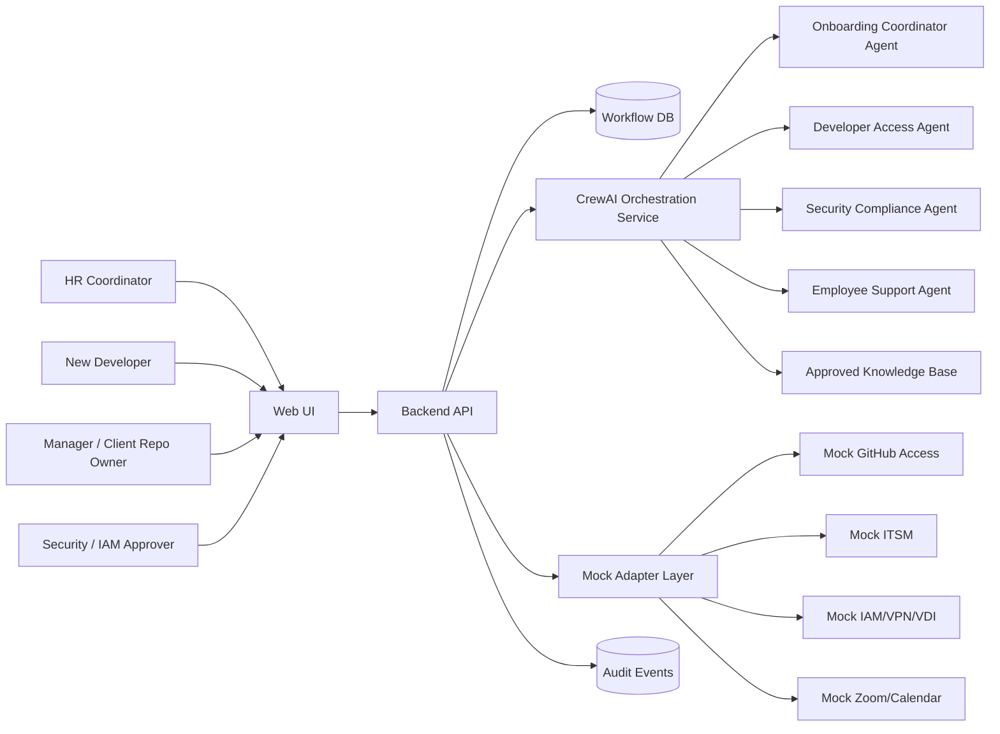

# System Architecture Document: Automated Employee Onboarding Workflow

## 1. MVP Architecture Philosophy & Principles

### MVP Design Principles

- Operator feedback first: prioritize clear HR, IT, security, manager, client repository owner, and new developer workflows over broad enterprise automation.
- Deterministic workflow state: agents may recommend, draft, summarize, and validate, but the application database is the source of truth for onboarding cases, tasks, approvals, blockers, and audit events.
- Human approvals for sensitive access: client GitHub repositories, Cisco VPN, Citrix VDI, container registries, identity groups, and privileged tooling require accountable human approval before completion.
- Least-privilege by design: every access request must tie permission level to role, project, employment type, start date, and expected review/expiration date.
- Evidence-based completion: setup tasks are marked complete only after explicit validation evidence is recorded.
- No secrets in prompts or logs: passwords, MFA secrets, private keys, personal access tokens, recovery codes, and client source code are never stored or sent to the agent runtime.
- Observable by default: task transitions, recommendations, approvals, connector calls, errors, and escalations are logged as audit events.
- Mock first, integrate later: MVP uses realistic mock adapters for external systems while keeping adapter boundaries compatible with later production integrations.

### Core vs Future Features

MVP scope:

- Developer onboarding case creation.
- Role-based onboarding plan generation.
- Task dashboard and task detail views.
- Mocked request flows for client GitHub, VS Code, Docker or approved runtime, Cisco VPN, Zoom, and Citrix VDI.
- Approval, blocker, escalation, and evidence tracking.
- Knowledge-grounded employee support assistant.
- Audit trail and basic operational metrics.

Future work:

- Real HRIS, ITSM, GitHub Enterprise, IAM, VPN, VDI, calendar, and collaboration integrations.
- Multi-client configuration and commercial tenant separation.
- Offboarding, internal transfer, contractor onboarding, and access recertification workflows.
- Advanced analytics, policy-change impact analysis, and production-grade monitoring.
- Full enterprise compliance automation beyond the MVP security baseline.

Explicit exclusions:

- Payroll, benefits, or legal-record changes.
- Autonomous source-code, VPN, VDI, identity, or privileged access provisioning without human approval.
- Storage of credentials, personal access tokens, private keys, or client source code.
- Replacement of HRIS, ITSM, GitHub, IAM, Zoom, VPN, or VDI platforms.

### Technical Architecture Decisions

| Decision ID | Decision | Rationale | Source |
| :-- | :-- | :-- | :-- |
| ADR-001 | Use a web application with backend API and persisted workflow state | PRD requires dashboards, task detail views, approvals, blockers, evidence checks, and audit events | PRD §§3-6 |
| ADR-002 | Use `crewai` as the MVP agent runtime | `aamad.config.yml` selects `crewai`; PRD states Phase 2 should use CrewAI-compatible orchestration where appropriate | PRD §3, config |
| ADR-003 | Limit MVP to four runtime agents | SAD template recommends 3-4 specialized agents maximum for MVP; PRD lists many conceptual agents but MVP should stay lean | PRD §3, SAD template |
| ADR-004 | Use mock adapters for external systems | PRD scopes real external writes out of MVP unless explicitly approved | PRD §8 |
| ADR-005 | Keep agent output advisory until reviewed or validated | Sensitive access and setup workflows require approval, evidence, and auditability | MRD, PRD §§3-5 |
| ADR-006 | Use non-streaming agent execution for MVP workflow actions | Workflows produce structured plans and task updates; live streaming is not required for MVP value | PRD §§4, 6 |
| ADR-007 | Use retrieval-grounded support responses | Employee support must answer from approved knowledge sources or escalate | PRD FR-011 |

## 2. Multi-Agent System Specification

### Agent Architecture Requirements

The MVP uses four specialized agents coordinated through the backend orchestration service. These agents consolidate PRD agent definitions into a lean implementation set.

#### Agent: onboarding_coordinator_agent

- Responsibility: Generate onboarding plans, coordinate task dependencies, summarize case readiness, and escalate blockers.
- Input context: employee profile, role profile, project/client profile, required tools, existing task state, blocker state.
- Output: structured onboarding plan, task update recommendations, readiness summary, escalation recommendations.
- Tools: task service, onboarding case service, notification adapter, audit event service.
- Restrictions: cannot directly grant access or mark sensitive setup complete without approval/evidence.

#### Agent: developer_access_agent

- Responsibility: Prepare and track developer setup/access requests for client GitHub repositories, VS Code, Docker/runtime, Cisco VPN, Zoom, and Citrix VDI.
- Input context: role profile, project/client assignment, environment profile, access matrix, pending requests, approval state.
- Output: access request drafts, validation checklist, missing-prerequisite report, setup readiness summary.
- Tools: mock GitHub request adapter, mock ITSM adapter, mock IAM/VPN/VDI adapter, evidence-check service, audit event service.
- Restrictions: no passwords, MFA secrets, private keys, personal access tokens, recovery codes, or client source code.

#### Agent: security_compliance_agent

- Responsibility: Evaluate access requests against least-privilege, approval, audit, and data-minimization rules.
- Input context: access request, role profile, permission level, project/client constraints, security policy snippets.
- Output: approve-for-human-review recommendation, risk flags, missing approval requirements, policy escalation.
- Tools: policy knowledge adapter, audit event service, approval service.
- Restrictions: cannot override human approvers; cannot approve itself.

#### Agent: employee_support_agent

- Responsibility: Answer onboarding questions from approved knowledge sources and guide users to next tasks.
- Input context: user role, current onboarding case, relevant allowed knowledge articles, task status.
- Output: cited answer, next action, or escalation request.
- Tools: knowledge base retrieval adapter, task status lookup, escalation service.
- Restrictions: must escalate when answer is missing, sensitive, or low confidence.

### Task / Turn Orchestration

Primary onboarding flow:

1. HR coordinator creates onboarding case.
2. Backend validates required fields and persists `OnboardingCase` and `EmployeeProfile`.
3. `onboarding_coordinator_agent` generates a role-based plan.
4. Backend normalizes the plan into deterministic `Task` and `AccessRequest` records.
5. `developer_access_agent` drafts setup/access request details for developer-specific systems.
6. `security_compliance_agent` evaluates sensitive access requests and flags missing approvals.
7. Human users approve, reject, or request changes through the application.
8. Mock adapters simulate request status changes and evidence checks.
9. `onboarding_coordinator_agent` summarizes readiness and blockers.
10. `employee_support_agent` handles onboarding questions using approved knowledge only.

Expected output formats:

- Agent plan output: JSON object with `case_id`, `tasks`, `access_requests`, `dependencies`, `risks`, and `questions`.
- Access request output: JSON object with `request_type`, `target_system`, `permission_level`, `approver`, `prerequisites`, `validation_method`, and `risk_flags`.
- Support answer output: JSON object with `answer`, `sources`, `confidence`, `next_action`, and `escalation_required`.
- Readiness summary output: JSON object with `ready`, `blocked_tasks`, `pending_approvals`, `critical_path`, and `recommended_next_actions`.

Error handling:

- Missing required case data: return validation error and do not create sensitive requests.
- Agent schema mismatch: reject output, log audit event, and surface retry option.
- Low-confidence support answer: escalate to relevant owner.
- Mock adapter failure: create visible blocker and preserve manual fallback status.
- Approval denied: record denial reason and route back to requester/manager.
- Timeout: mark agent run failed and allow user retry without duplicating tasks.

Performance budgets:

- Plan generation: under 30 seconds for a standard onboarding case.
- Setup request drafting: under 30 seconds for a standard developer setup profile.
- Support response: under 10 seconds for knowledge-grounded questions.
- Max agent iterations: 3 per task for MVP.
- Token/cost control: summarize only necessary case context; do not include raw documents or source code.

### Runtime-Conditional Configuration

Selected runtime: `crewai`.

CrewAI configuration requirements:

- Crew composition: four agents listed above.
- Process type: sequential for onboarding plan generation and setup request drafting; hierarchical coordination may be considered future work.
- Agent/task config: YAML or equivalent config should define role, goal, backstory, tools, max iterations, and task expected output schemas.
- `max_iter`: default 3 for MVP unless Build-phase testing proves a lower value is sufficient.
- Task context chaining: coordinator output feeds developer access; developer access output feeds security compliance; final results feed readiness summary.
- Tool boundaries: tools must call backend services/adapters, not external systems directly in the MVP.
- Logging: each agent run gets a correlation ID linked to `AuditEvent`.

## 3. Frontend Architecture Specification

### Technology Stack

PRD does not mandate a frontend framework. Recommended MVP default:

- Framework: React with a modern build tool or Next.js if chosen during setup.
- Language: TypeScript preferred for type-safe API contracts; repository primary language remains Python for backend/runtime per `aamad.config.yml`.
- Styling: minimal system theme matching `aamad.config.yml`.
- State management: route-local state plus a lightweight API client; avoid heavy global state until needed.
- Accessibility: keyboard navigation, semantic headings, visible focus, and status text not dependent on color alone.

### Application Structure

Recommended routes/pages:

- `/cases`: onboarding case list.
- `/cases/new`: create developer onboarding case.
- `/cases/:caseId`: case overview, readiness, blockers, and audit summary.
- `/cases/:caseId/tasks`: task dashboard.
- `/cases/:caseId/access-requests/:requestId`: setup/access request detail.
- `/approvals`: approvals queue for managers, security, and client repository owners.
- `/support`: knowledge-grounded onboarding assistant UI.

Component groups:

- Case summary panel.
- Role-based task table.
- Developer setup checklist.
- Access request form/detail.
- Approval decision panel.
- Blocker/escalation panel.
- Evidence check card.
- Audit event timeline.
- Support assistant panel.

### Interface Requirements

- Each setup request must show target system, owner, approver, status, due date, blocker reason, permission level, validation method, and completion evidence.
- Developer setup checklist must include client GitHub, VS Code, Docker/runtime, Cisco VPN, Zoom, and Citrix VDI.
- Sensitive requests must visually indicate approval requirement and policy status.
- User-visible errors must include next action and owner.
- Future-work placeholders can be shown for real integrations, analytics, and multi-client configuration, but must not block MVP workflows.

## 4. Backend Architecture Specification

### API Architecture

Recommended API style: REST JSON for MVP.

Core endpoints:

- `POST /api/onboarding-cases`: create onboarding case.
- `GET /api/onboarding-cases`: list cases.
- `GET /api/onboarding-cases/{case_id}`: retrieve case detail.
- `POST /api/onboarding-cases/{case_id}/generate-plan`: run coordinator/developer setup planning.
- `GET /api/onboarding-cases/{case_id}/tasks`: list tasks.
- `PATCH /api/tasks/{task_id}`: update task status or evidence.
- `GET /api/onboarding-cases/{case_id}/access-requests`: list setup/access requests.
- `POST /api/access-requests/{request_id}/approval-decisions`: approve, reject, or request changes.
- `POST /api/access-requests/{request_id}/validate`: run/mock evidence validation.
- `POST /api/support/query`: ask knowledge-grounded support question.
- `GET /api/onboarding-cases/{case_id}/audit-events`: retrieve audit timeline.
- `GET /health`: health check.

Common error envelope:

```json
{
  "error": {
    "code": "VALIDATION_ERROR",
    "message": "Required field missing",
    "details": [{ "field": "client_project", "issue": "required" }],
    "correlation_id": "..."
  }
}
```

### Data Architecture

MVP requires persistence because PRD depends on workflow state, approvals, blockers, evidence, and audit.

Logical data model:

- `onboarding_cases`: case metadata, employee, role, client/project, readiness state.
- `employee_profiles`: employee attributes needed for onboarding.
- `role_profiles`: templates for developer roles and required setup tasks.
- `tasks`: actionable onboarding tasks.
- `access_requests`: sensitive and non-sensitive setup/access requests.
- `approval_decisions`: approval, denial, requested-change events.
- `evidence_checks`: validation method/result for setup completion.
- `blockers`: blocker reason, owner, SLA, escalation target.
- `audit_events`: append-only event stream for recommendations/actions.
- `knowledge_articles`: approved article metadata and retrieval references.

Minimum required fields should be enforced with validation at the API boundary.

### Runtime Integration Layer

- Backend service owns runtime invocation.
- Agent configuration is loaded from code/config, not user-editable prompt text.
- Agent calls receive minimal scoped context built from persisted records.
- Agent outputs must be schema-validated before database updates.
- All agent runs include correlation IDs.
- Prompt traces should omit secrets, credentials, personal access tokens, and client code.

### Authentication & Secrets

Environment variable names only:

- `APP_ENV`
- `DATABASE_URL`
- `LLM_PROVIDER`
- `LLM_MODEL`
- `LLM_API_KEY`
- `SESSION_SECRET`
- `ALLOWED_ORIGINS`
- `LOG_LEVEL`

Future real-integration env var names, if approved:

- `GITHUB_APP_ID`
- `GITHUB_APP_PRIVATE_KEY_PATH`
- `GITHUB_ORG`
- `ITSM_BASE_URL`
- `ITSM_CLIENT_ID`
- `ITSM_CLIENT_SECRET`
- `IAM_BASE_URL`
- `IAM_CLIENT_ID`
- `IAM_CLIENT_SECRET`

No secret values should be committed or included in generated artifacts.

## 5. DevOps & Deployment Architecture

### CI/CD

Minimal MVP pipeline:

- Install dependencies.
- Run formatter/lint checks.
- Run unit tests.
- Run integration tests for API and mock adapters.
- Run build.
- Run basic security/dependency audit.

### Hosting

MVP hosting target can be local-first with a simple cloud deployment path.

Recommended components:

- Frontend static/app host.
- Backend API service.
- Managed or local database.
- Optional background worker for reminders/status checks.
- Health-check endpoint at `/health`.

### Observability

Baseline:

- Structured application logs.
- Agent run logs with correlation IDs.
- Audit event table.
- Request/error metrics.
- Task SLA and blocker metrics.
- LLM usage/cost counters.

Future:

- APM integration.
- Distributed tracing.
- Alerting by SLA breach and adapter failure.
- Security event monitoring integration.

## 6. Data Flow & Integration Architecture

### Primary Data Flow



### Integration Boundaries

MVP mock adapters:

- GitHub access request adapter.
- ITSM request adapter.
- IAM/VPN/VDI request adapter.
- Zoom/calendar readiness adapter.
- Knowledge base retrieval adapter.
- Notification adapter.

Real integrations are future work unless explicitly approved by stakeholders and security reviewers.

### Error Propagation

- Adapter errors become task blockers.
- Agent schema errors become retryable workflow errors.
- Approval denials update request status and notify requester.
- Validation failures keep tasks open and show next action.
- Knowledge gaps create escalation tickets or tasks.

## 7. Performance & Scalability Specifications

MVP targets from PRD:

- Dashboard page load: under 2 seconds for normal MVP datasets.
- Plan generation: under 30 seconds for standard onboarding case.
- Setup request drafting: under 30 seconds for standard developer setup profile.
- Support answer: under 10 seconds for knowledge-grounded questions.
- Status update persistence: under 1 second after user action.
- Concurrency: at least 10 active users and 50 active onboarding cases in local/test deployment.

Scalability path:

- Add background workers for polling real request systems.
- Split adapter calls from synchronous API requests.
- Cache knowledge retrieval where safe.
- Add tenant/client boundaries for commercial deployment.
- Scale backend and database after MVP telemetry establishes bottlenecks.

Cost controls:

- Use deterministic logic for status and workflow persistence.
- Limit agent context to needed case/task data.
- Keep `max_iter` low.
- Track LLM cost by onboarding case and agent run.
- Prefer retrieval snippets over large document injection.

## 8. Security & Compliance Architecture

### Authentication and Authorization

MVP:

- Implement role-aware application access model even if authentication is mocked initially.
- Roles: HR coordinator, new developer, IT service desk, security/IAM approver, manager, client repository owner, admin.
- Only authorized users can approve or alter sensitive access requests.
- Audit viewer access should be restricted to authorized operations/security roles.

Production path:

- SSO integration.
- MFA enforcement according to corporate/client policy.
- Fine-grained role-based access control.
- Periodic access review.

### Data Protection

- Do not store passwords, MFA secrets, recovery codes, private keys, personal access tokens, or client source code.
- Minimize employee personal data in prompts, logs, and audit payloads.
- Encrypt data in transit and at rest in production.
- Store only metadata required for evidence and audit.
- Mask sensitive identifiers in logs where possible.

### Compliance Considerations

Known compliance concerns:

- Employee personal data privacy.
- Client source-code access governance.
- Auditability for access approval and denial.
- Least privilege for VPN, VDI, GitHub, container registry, and identity groups.
- Security assessment required by project configuration.

Deferred/open compliance items:

- Specific jurisdictional privacy requirements.
- Client contractual security requirements.
- Retention policy for audit events and support transcripts.
- SOC 2 or enterprise control mapping.

## 9. Testing & Quality Assurance Specifications

### MVP Test Expectations

Unit tests:

- Case creation validation.
- Role profile task generation.
- Access request schema validation.
- Approval decision rules.
- Evidence check status transitions.
- Audit event creation.
- Agent output schema validation.

Integration tests:

- Create onboarding case -> generate plan -> create tasks/access requests.
- Client GitHub access request approval flow.
- Docker/runtime validation success and failure.
- Cisco VPN blocked/validated flow.
- Zoom readiness validation.
- Citrix VDI entitlement validation.
- Knowledge support answer and escalation behavior.
- Audit timeline for sensitive access request.

Smoke/acceptance tests:

- HR creates developer onboarding case.
- Developer sees checklist.
- Repository owner approves GitHub access request.
- IT validates VS Code, Docker/runtime, Zoom, VPN, and VDI tasks.
- Security reviews sensitive access.
- Manager sees readiness summary.

Security checks:

- No secrets committed.
- No secret-like values in prompts/logs/audit events.
- Unauthorized role cannot approve sensitive request.
- Access request permission level is required.
- Dependency audit completed before delivery.

### Evaluation Criteria

| ID | Dimension | Metric | Threshold | Grading Method | Source |
|----|-----------|--------|-----------|-----------------|--------|
| EC-001 | Accuracy | Role-based onboarding plan includes required P0 developer setup tasks for client GitHub, VS Code, Docker/runtime, Cisco VPN, Zoom, and Citrix VDI when applicable | 95% of complete test cases | Code-based check against generated task schema | PRD §§4, 7 |
| EC-002 | Accuracy | Access request drafts include owner, approver, permission level, due date, validation method, and escalation path | 95% of generated P0 access requests | Code-based schema and field completeness checks | PRD §§3-4 |
| EC-003 | Latency | Standard onboarding plan generation completes within performance budget | <= 30 seconds | Automated timing test | PRD §5 |
| EC-004 | Latency | Knowledge-grounded support answer completes within performance budget | <= 10 seconds | Automated timing test | PRD §5 |
| EC-005 | Safety | Support agent escalates low-confidence or sensitive questions instead of guessing | >= 90% of curated sensitive/unknown prompts | Human review or LLM-judge-assisted review with human spot check | PRD FR-011 |
| EC-006 | Security | Secrets, MFA values, private keys, personal access tokens, recovery codes, and client source code are absent from prompts/logs/audit payloads | 100% required | Static/log inspection and test fixtures | PRD §§3, 5 |
| EC-007 | Security | Sensitive access request cannot be marked complete without approval and evidence | 100% required | Integration test | PRD FR-003, FR-006, FR-008 |
| EC-008 | Cost | LLM usage is tracked per onboarding case and agent run | 100% of agent runs include cost/usage metadata where provider exposes it | Code-based telemetry check | PRD §7 |

`@qa.eng` will implement the golden dataset, graders, QA artifacts, and eval runner during Build.

## 10. MVP Launch & Feedback Strategy

Pilot criteria:

- MRD, PRD, and SAD approved for Build.
- MVP runs locally with mock adapters.
- All P0 workflows complete in smoke tests.
- Security assessment has no unresolved critical findings.
- User guide documents how to create a developer onboarding case and validate setup tasks.

Pilot scenario:

1. Create a simulated developer onboarding case.
2. Generate role-based onboarding plan.
3. Process client GitHub, VS Code, Docker/runtime, Cisco VPN, Zoom, and Citrix VDI setup requests.
4. Approve and validate sensitive access tasks using mock adapters.
5. Ask the support assistant onboarding questions.
6. Review readiness summary, blockers, and audit trail.

Feedback collection:

- HR: clarity of onboarding status and missing data.
- IT: completeness of setup requests and validation evidence.
- Security: least-privilege and audit sufficiency.
- Manager/client repo owner: approval workflow usability.
- Developer: clarity of next action and reduction of setup confusion.

Iteration priorities:

- Improve role profiles and setup request templates.
- Add real integration for the single highest-value external system.
- Refine evidence validation and escalation rules.
- Expand knowledge base coverage.

## Implementation Guidance for AI Development Agents

1. `@project.mgr`: scaffold frontend, backend, persistence, env examples, and local run instructions.
2. `@frontend.eng`: build role-based dashboards, developer setup checklist, access request detail, approval queue, blocker panel, and support assistant UI using mock data first.
3. `@backend.eng`: implement REST API, persisted workflow state, CrewAI orchestration wrapper, mock adapters, schema validation, and audit events.
4. `@integration.eng`: wire frontend to backend API, run end-to-end mocked onboarding flow, and document integration gaps.
5. `@qa.eng`: implement unit, integration, smoke, and eval criteria tests mapped to PRD/SAD IDs.
6. `@security.eng`: assess secrets handling, RBAC, access workflows, prompt/log/audit data minimization, dependency risk, and mock-to-real integration boundaries.
7. `@devops.eng`: package local/cloud runbook, CI checks, health endpoint, `.env.example`, and user guide.

## Architecture Validation Checklist

- [x] PRD requirements mapped to architectural components.
- [x] Agents designed for the domain and selected runtime.
- [x] Frontend and backend contracts agree on schemas / non-streaming MVP responses.
- [x] Secrets via env vars only.
- [x] MVP vs Future Work boundaries explicit.
- [x] Resolved `AAMAD_TARGET_RUNTIME` recorded in Audit.

## Sources

- `project-context/1.define/mrd.md`
- `project-context/1.define/prd.md`
- `.cursor/templates/sad-template.md`
- `.cursor/agents/system-arch.md`
- `aamad.config.yml`

## Assumptions

- The SAD is MVP-focused because the user requested a high-level architecture.
- `crewai` is the selected runtime based on `aamad.config.yml`.
- The initial product is local/test deployable with mock adapters.
- The frontend framework is not mandated by PRD; React or Next.js can be selected by Build-phase personas.
- Persistence is required for MVP because PRD requires approval, blocker, evidence, and audit state.
- Real external system writes require stakeholder and security approval and are future work.
- User stories have not yet been generated; traceability currently maps to PRD feature IDs and MRD findings.

## Open Questions

- Which specific frontend framework should Build use: React/Vite, Next.js, or another approved stack?
- Which database should be used for MVP persistence?
- Should authentication be mocked for capstone demo or integrated with SSO in the MVP?
- Which ticketing/request system should be modeled first if one real integration is added?
- Which client GitHub organization/repository permission matrix should seed role profiles?
- Should Docker validation run locally, inside Citrix VDI, or both depending on role?
- What retention policy applies to onboarding audit events and support chat transcripts?
- What exact success thresholds should stakeholders approve if PRD targets are adjusted during Build?

## Audit

- Timestamp: 2026-09-23
- Persona id: `system-arch`
- Action: `create-sad`
- Artifact: `project-context/1.define/sad.md`
- Source artifacts: `project-context/1.define/mrd.md`, `project-context/1.define/prd.md`
- Resolved `AAMAD_TARGET_RUNTIME`: `crewai`
